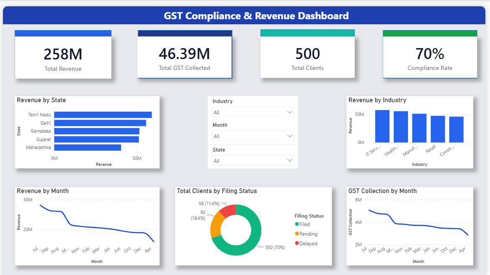

 # GST Compliance & Revenue Dashboard

## Overview

This project is an interactive Power BI dashboard designed to monitor GST compliance, revenue performance, and tax collection.

## Dashboard Features

- KPI Cards
- Revenue Analysis
- GST Collection Analysis
- Filing Status Analysis
- State-wise Revenue
- Industry-wise Revenue
- Interactive Filters

## Tools Used

- Power BI
- Microsoft Excel
- Power Query

## Dataset

- 500 Client Records

## Dashboard Preview

## Key Metrics

- Revenue: ₹258M
- GST Collected: ₹46.39M
- Clients: 500
- Compliance Rate: 70%
